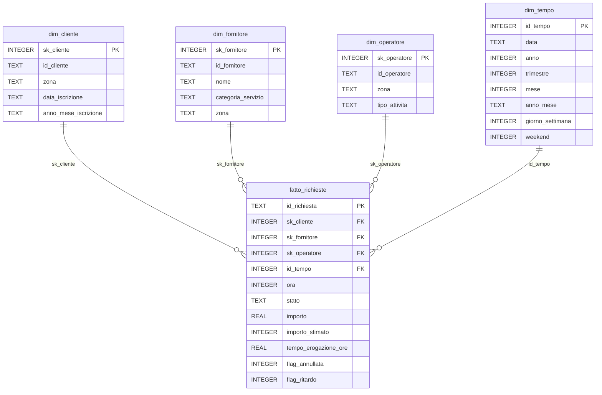

# TecnoSolution Analytics

Prototipo di analisi dati per **TecnoSolution**, una startup (inventata) di assistenza tecnica IT on-demand attiva nei capoluoghi siciliani.

Project Work di laurea – Informatica per le Aziende Digitali (L-31), Università Telematica Pegaso.
Tema 1 "La digitalizzazione dell'impresa", traccia 21.

> Tutti i dati sono sintetici, generati per l'occasione, senza alcuna informazione personale.

## Cosa contiene

| Componente | File | Descrizione |
|---|---|---|
| Generatore dati | `src/genera_dati.py` | crea clienti, fornitori, operatori e richieste in CSV |
| ETL | `src/etl.py` | legge i CSV, li pulisce e li carica nel data warehouse SQLite |
| Data warehouse | `data/warehouse/tecnosolution.db` | schema a stella: fatto Richieste + dimensioni Cliente, Fornitore, Operatore, Tempo |
| Query KPI | `sql/` | interrogazioni SQL per gli indicatori principali |
| Dashboard | `dashboard/app.py` | dashboard interattiva Streamlit |

## Struttura delle cartelle

```
tecnosolution-analytics/
├── data/
│   ├── raw/          # CSV generati
│   └── warehouse/    # database SQLite
├── src/              # generatore dati ed ETL
├── sql/              # schema e query KPI
├── dashboard/        # app Streamlit
└── docs/img/         # screenshot per il report
```

## Come riprodurre il lavoro

Requisiti: Python 3.12.

```
python -m venv .venv
.venv\Scripts\activate          # su macOS/Linux: source .venv/bin/activate
pip install -r requirements.txt
```

### 1. Generare i dati sintetici

```
python src/genera_dati.py
```

Crea `clienti.csv`, `fornitori.csv`, `operatori.csv` e `richieste.csv` in `data/raw/`.
Parametri principali (tutti facoltativi):

| Parametro | Default | Significato |
|---|---|---|
| `--seed` | 42 | seme casuale: stesso seme = stessi dati |
| `--clienti` / `--fornitori` / `--operatori` / `--richieste` | 450 / 300 / 320 / 600 | numero di record (la traccia chiede 300–600) |
| `--inizio` / `--fine` | 2025-07-01 / 2026-07-01 | periodo coperto dalle richieste |
| `--annullate` / `--ritardi` | 0.08 / 0.12 | quota di richieste annullate e in ritardo (oltre 48 ore) |
| `--sporcizia` | 0.03 | quota di righe con imperfezioni da correggere nell'ETL (0 = dati già puliti) |

Le imperfezioni introdotte di proposito (maiuscole e spazi incoerenti, date in formato italiano, virgola decimale, valori mancanti, righe duplicate) servono a verificare la fase di pulizia dell'ETL.

### 2. Eseguire l'ETL e creare il data warehouse

```
python src/etl.py
```

Legge i CSV, li pulisce e carica il database `data/warehouse/tecnosolution.db`, ricreandolo da zero a ogni esecuzione.
Ogni correzione applicata viene contata e salvata in `data/warehouse/log_etl.txt`.

Pulizie e controlli eseguiti:
- grafia canonica per zone, categorie, tipi di attività e stati;
- conversione delle date in formato GG/MM/AAAA e dei numeri con la virgola decimale;
- rimozione delle righe duplicate e dei codici ripetuti;
- importi mancanti: 0 per le richieste annullate, mediana della categoria per le altre (segnalati con `importo_stimato = 1`);
- integrità referenziale (ogni richiesta punta a cliente, fornitore e operatore esistenti);
- coerenza tra stato e tempo di erogazione: oltre 48 ore la richiesta è "In ritardo".

### 3. Calcolare gli indicatori

```
python src/kpi.py
```

Esegue le query di `sql/kpi.sql`: richieste totali, incassi, tempo medio di erogazione, clienti attivi, percentuale di clienti che tornano, andamento mensile, top 5 fornitori, distribuzioni per zona, categoria, giorno e ora.

## Modello dei dati (schema a stella)



Granularità del fatto: una riga per richiesta di servizio. La dimensione Tempo è a livello di giorno; l'ora è un attributo del fatto. Lo schema completo è in `sql/schema.sql`.

Il comando per la dashboard verrà aggiunto quando il componente sarà completato.
